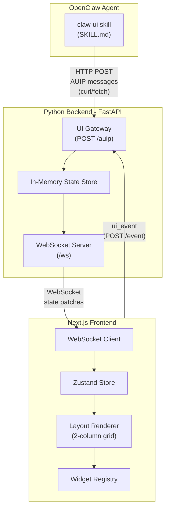

# Agent-Native UI System MVP

## Architecture




## Repository Structure

```
claw-ui/
  backend/                    # Python FastAPI server
    pyproject.toml
    app/
      main.py                 # FastAPI app, CORS, mount routes
      state.py                # In-memory UIState model + patch logic
      models.py               # Pydantic models for AUIP protocol
      routes/
        auip.py               # POST /auip - receive AUIP messages
        events.py             # POST /event - receive UI events
      ws/
        manager.py            # WebSocket connection manager + broadcast
  frontend/                   # Next.js app
    package.json
    next.config.js
    tailwind.config.ts
    app/
      layout.tsx
      page.tsx                # Main dashboard page
    lib/
      store.ts                # Zustand store (applyPatch, state)
      ws.ts                   # WebSocket client hook
      types.ts                # TypeScript types matching AUIP protocol
    components/
      Layout.tsx              # 2-column layout renderer
      WidgetRenderer.tsx      # Dynamic widget dispatcher
      widgets/
        NewsWidget.tsx         # feed:news
        WeatherWidget.tsx      # info:weather
        CryptoWidget.tsx       # finance:crypto
        TodoWidget.tsx         # productivity:todo
        TextWidget.tsx         # content:text
  skill/                      # OpenClaw skill
    SKILL.md                  # Teaches agent AUIP protocol
```

## 1. Backend (Python FastAPI)

### State Model (`app/state.py`)

In-memory singleton matching the spec's UI state model:

```python
state = {
    "views": {
        "main": {
            "layout": {
                "columns": [
                    {"id": "col_1", "widget_ids": []},
                    {"id": "col_2", "widget_ids": []}
                ]
            }
        }
    },
    "widgets": {}
}
```

### AUIP Protocol Models (`app/models.py`)

Pydantic models for the envelope + all operations:

- Envelope: `protocol_version`, `type` (set_ui | patch_ui), `target.view_id`, `payload`
- Operations: `add_widget`, `remove_widget`, `move_widget`, `update_widget`, `set_layout`
- Widget: `id`, `kind`, `variant`, `title`, `config`
- Placement: `column_id`, `position`

### Endpoints

- `POST /auip` - Receives AUIP messages from OpenClaw, validates, applies to state, broadcasts delta via WebSocket
- `POST /event` - Receives UI events from the frontend (e.g., widget_removed by user)
- `GET /state` - Returns current full state (for initial frontend load)
- `WebSocket /ws` - Persistent connection for the frontend; sends `patch_ui` and `set_ui` messages

### Validation

- Reject unknown widget kinds
- Reject operations on non-existent widgets (for update/move/remove)
- Prevent duplicate widget IDs
- Limit patch size (max 20 operations per message)

## 2. Frontend (Next.js + React + Zustand + Tailwind)

### Zustand Store (`lib/store.ts`)

```typescript
interface UIState {
    views: Record<string, View>;
    widgets: Record<string, Widget>;
    applyPatch: (patch: PatchPayload) => void;
    setState: (state: UIStateData) => void;
}
```

### WebSocket Hook (`lib/ws.ts`)

- Connects to `ws://localhost:8000/ws` on mount
- Receives `patch_ui` and `set_ui` messages
- Calls `applyPatch` or `setState` on the Zustand store
- Auto-reconnect with exponential backoff

### Layout Renderer (`components/Layout.tsx`)

- Reads columns from `state.views.main.layout.columns`
- 2-column CSS Grid (responsive: 1 column on mobile)
- Maps `widget_ids` to `WidgetRenderer` components

### Widget Registry + Renderer

Registry maps `kind:variant` to React components:

- `feed:news` -> NewsWidget (shows title + list of items from config)
- `info:weather` -> WeatherWidget (shows location + temp/conditions)
- `finance:crypto` -> CryptoWidget (shows coin prices table)
- `productivity:todo` -> TodoWidget (shows checklist with toggle)
- `content:text` -> TextWidget (shows markdown/text block)

Each widget gets a card-style container with title bar, consistent styling via Tailwind.

### UI Events

When the user interacts (e.g., removes a widget, toggles a todo), send a `ui_event` POST to the backend so the agent can be notified.

## 3. OpenClaw Skill (`skill/SKILL.md`)

The skill teaches OpenClaw how to control the dashboard. It will:

- Describe the AUIP protocol (message format, operations)
- List available widget kinds and their configs
- Provide example `curl` commands the agent can execute via `bash` tool
- Explain the backend URL (configurable via skill config/env)

Example skill instruction to the agent:

```
To add a news widget:
bash curl -X POST http://localhost:8000/auip -H "Content-Type: application/json" -d '{
  "protocol_version": "1.0",
  "type": "patch_ui",
  "target": {"view_id": "main"},
  "payload": {
    "operations": [{
      "op": "add_widget",
      "widget": {"id": "w_news", "kind": "feed", "variant": "news", "title": "AI News", "config": {"items": [...]}},
      "placement": {"column_id": "col_1", "position": 0}
    }]
  }
}'
```

Skill metadata will require `CLAW_UI_URL` env var and declare itself in the `metadata.openclaw.requires.env` field.

## 4. Development Setup

- Backend: `uv` or `pip` for Python deps, `uvicorn` to run FastAPI (port 8000)
- Frontend: `pnpm` for Next.js deps, `next dev` (port 3000)
- Backend CORS configured to allow `localhost:3000`
- Single `docker-compose.yml` for running both together (optional, future)

## Key Design Decisions

- **No LLM subagent in the gateway** -- OpenClaw IS the LLM. The skill teaches it the protocol directly, so it constructs AUIP messages itself. This eliminates an intermediate LLM call and keeps the system simpler.
- **HTTP POST for AUIP input** (not WebSocket) -- simpler for the agent to call via `curl`/`bash` tool. WebSocket is used only for the frontend subscription.
- **In-memory state** for MVP -- fast and simple. The state resets on server restart. Redis/DB is a documented future path.
- **Widget configs carry display data** -- for MVP, the agent populates widget data (news items, weather info, etc.) directly in the config. No external API fetching in widgets themselves.
